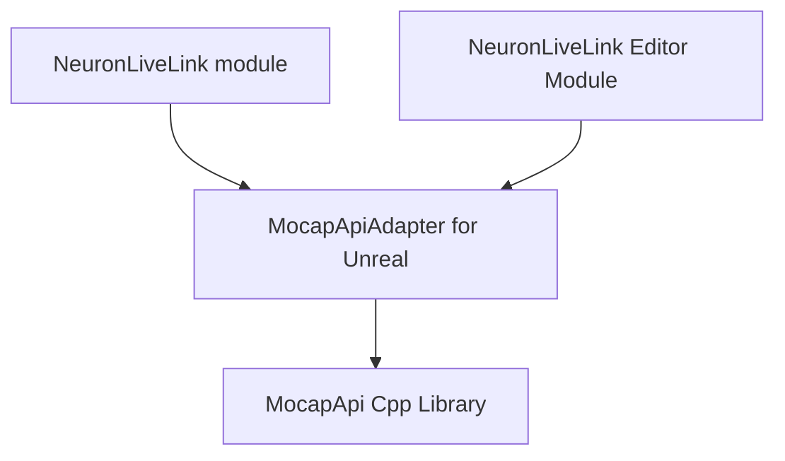

# PDD for AliceLiveLinkSDK

## architecture

## MocapApi

MocapApi.h MocapApi.dll

## MocapApiAdapter

*   MocapApiAdapter.h 
    *   FMocapApiAdapterModule unreal module file
*   MocapApiLog.h
    *   LogMocapApi log categorty for this module
*   MocapAppManager.h
    *   FMocapAppManager singleton manager class to manage MocapStructs
    *   AMocapAppManager singleton actor class, should use without livelink 
*   MocapStructs.h
    *   FMCAppSettings adapter for MocapApi IMCPSettings
    *   FMCRenderSetting adapter for MocapApi IMCPRenderSettings
    *   FMocapRigidBody adapter for MocapApi IMCPRigidBody
    *   FMocapTracker adapter for MocapApi IMCPTracker
    *   FMocapAvatar adapter for MocapApi IMCPAvatar
    *   UMocapApp adapter for MocapApi IMCPApplication

## NeuronLiveLink

*   NeuronBoneMappingInfo.h
    *   FNeuronBoneMappingInfo bone mapping struct
*   NeuronLiveLink.h
    *   FNeuronLiveLinkModule module file
*   NeuronLiveLinkBPLibrary.h
    *   UNeuronLiveLinkBPLibrary blurprint library for live link 
*   NeuronLiveLinkLog.h
    *   LogNeuronLiveLink log categorty for this module
*   NeuronLiveLinkRemapAsset.h
    *   !!! UNeuronLiveLinkRemapAsset live link remap asset for live link retargeting
*   NeuronLiveLinkSource.h
    *   FNeuronLiveLinkSource live link source subclass 
*   PNSAnimInstance.h
    *   UPNSAnimInstance derived from UAnimInstance which provide SubjectName get-set function
*   MocapClient.h
    *   FMocapAppClient for handle mocapapi evcents, and provide get functions
*   NeuronLiveLinkSourceFactory.h
    *   UNeuronLiveLinkSourceFactory derived from ULiveLinkSourceFactory
*   SNeuronLiveLinkSourceFactory.h
    *   SNeuronLiveLinkSourceFactory UI for create FNeuronLiveLinkSource 
*   SubjectNameSetter.h
    *   USubjectNameSetter interface

## NeuronLiveLinkEditor

*   LiveLinkEditorPrivate.h
    *   delare LogNeuronLiveLinkEditor
*   NeuronLiveLinkEditorModule.cpp
    *   private unreal module FNeuronLiveLinkEditorModule
*   NeuronBoneMappingWidget.h
    *   SNeuronBoneMappingWidget Customized ui for mapping bones, used in FNeuronLiveLinkRemapAssetDetailCustomization
*   NeuronLiveLinkRemapAssetDetailCustomization.h
    *   FNeuronLiveLinkRemapAssetDetailCustomization Customized ui for edit NeuronLiveLinkRemapAsset
