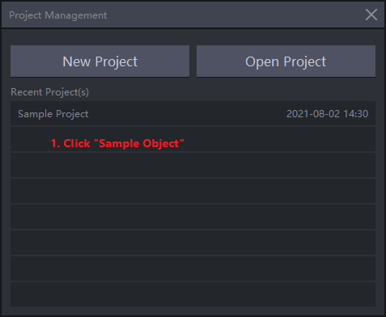

<!-- Suggest Edit With Typora -->

[TOC]

# Axis Unreal Live Link Plugin 使用手册

# 1. 插件简介

Axis Studio不仅可以导出动捕数据还可以输出实时动捕数据到第三方应用来驱动动画角色

Axis studio作为网络中的服务端向客户端电脑上的应用发送动捕数据，本文主要是关于如何在虚幻引擎中使用 NeuronLiveLink 插件进行驱动动捕数据


## 1.1 插件特点

* 支持虚幻引擎版本4.26 4.27 5.0 5.1 5.2
* 支持接收和处理道具 (PWR跟踪道具)动作捕捉数据 (参考我们的VPS工程)
* 支持驱动不是使用T-Pose作为基准姿态(比如使用A-Pose)的模型
* 支持接收和处理Axis Studio发送的带有位移的数据
* 向Axis Studio发送控制指令

## 1.2 已知问题

* 运行打包版本可能会引发错误

## 1.3 关于

1. 支持开发平台: Win64
2. 文中的图片是基于英文版本的截图，中文版本不再使用新的截图而是在英文截图基础上进行简单说明

# 2. 安装

1. 在虚幻引擎工程目录创建Plugins文件夹(如果文件夹不存在)

2. 解压**NeuronLiveLink** 插件压缩包到Plugins目录
   
   
   
   ```txt
    图片注释说明：
    1. 创建Plugins目录
    2. 添加NeuronLiveLink插件目录（加压缩）到Plugins目录
   ```

# 3. 虚幻引擎工程设置

1. 打开你的工程, 在编辑菜单下选择插件菜单项
   
   
   ```txt
   图片中英文翻译：
   Edit -> 编辑
   Plugins -> 插件
   ```

2. 在Animation部分, 启用Live Link插件（勾选插件的已启用选择框）.
    
   
   ```txt
   图片中英文翻译：
   Enabled -> 已启用
   ```
   
     在已安装部分,启用NeuronLiveLink 插件并重启虚幻编辑器
   
    
   
   ```tex
   图片中英文翻译：
   Enabled -> 已启用
   New! -> 最新
   ```

3. 在内容浏览器，在视图选项中勾选显示插件内容。
   
    
    
   
   ```txt
   图片中英文翻译：
   Content Browser -> 内容浏览器
   View Options -> 视图选项
   Show Plugin Content  -> 显示插件内容
   ```
   
   > 上述操作会启用Live Link插件， 这个插件可以用于连接外部数字内容制作（DCC）工具。为使你的数字内容制作工具连接到UE4, 你需要启用上述Live Link插件，在这部分我们会建立UE4 和Axis Studio的连接。

# 4. 快速开始

## 4.1 打开Axis Studio并回放文件

> 下述操作步骤基于Axis Studio2.4.11579.1201, 对于其他版本的操作过程大体相似，这里不再赘述，请参考相关版本的Axis Studio手册查找详细操作步骤。
> 
> 
> 你也可以通过Axis Studio发送实时捕捉数据, 这时你需要编辑设置的BVH-捕捉部分
> 
> 图片中英文翻译：
> Axis Studio Version -> Axis Studio 版本

* 按下图步骤打开 "Axis Studio"
  
    
  
  ```txt
  图片中英文翻译：
  1. Type "Axis" for search -> 1.在搜索栏输入Axis进行搜索
  2. Click Axis Studio to open the app -> 2.单击Axis Studio图标打开应用程序
  3. or You can double click the shortcut to open the app -> 3.或者你可以通过双击Axis Studio的快捷方式图标打开应用程序
  ```

* 打开并回放一个文件
    
    
  
  ```txt
  图片中英文翻译：
  1. Click "Sample Project" -> 单击"Sample Project"
  1. Double Click a file to replay, for example double click "2.0-Run and Jump" -> 双击一个文件进行回放，比如双击"2.0-Run and Jump"
  ```

* 打开设置菜单并进行修改
    
    
  
  ```txt
  图片中英文翻译：
  Settings -> 设置
  1. Open Settings Menu -> 1.打开设置菜单
  1. Click BVH Broadcasting -> 1.单击BVH数据转发
  BVH Broadcasting -> BVH数据转发
  BVH-Edit -> BVH-编辑
  2. Scroll to "BVH-Edit" to make it enabled -> 2.滚动右侧滚动条到"BVH-编辑"并启用（点击右侧按钮到启用状态）
  3. Check to Use Rotation "YXZ" and Type is "Binary" -> 3.检查并确保旋转使用"YXZ"类型使"用二进制"
  Rotation -> 旋转
  Type -> 类型
  Binary -> 二进制
  Displacement -> 位移
  Use old header format -> 使用旧帧头
  OPT -> 光学
  4. Use UDP anf set address and Port -> 使用UDP协议并设置地址和端口号
  Protocol -> 协议
  Local Address -> 本地地址
  Destination Address -> 目标地址
  Port -> 端口
  5. Click Ok to save settings -> 单击确定按钮保存设置
  OK -> 确定
  Cancel -> 取消
  ```

* 开始回放
    
  
  ```txt
  图片中英文翻译：
  1. Click to loop the replay -> 点击启用循环
  2. Click to Start replay -> 点击开始回放
  ```

## 4.2 如果使用Axis Hybrid Manager使用如下步骤修改数据输出

使用Axis Hybrid Manager的用户请参考下面的步骤打开mocap 数据输出或者参考软件的文档数据输出管理部分进行操作

* 打开设置窗口
  
  
  ```txt
  图片中英文翻译：
  1. Click button to Open menu -> 点击按钮打开菜单
  2. Click Preference to open dialog -> 点击Preference打开对话框
  ```

* 开启mpcap输出
  
  
  ```txt
  1. Select Data Output Tab -> 选择Data Output
  2. Enable Mocap data output -> 开启Mocap数据输出
  3. Select Protocol and Edit IP and port -> 选择协议并编辑IP地址和端口
  4. Click OK -> 点击OK按钮
  ```

## 4.3 打开虚幻引擎工程并驱动动画

* 打开你的带有Neuron Live Link插件的虚幻工程

* 打开Live Link（实时链接）窗口
    
  
  ```txt
  图片中英文翻译：
  Windows -> 窗口
  Live Link -> 实时链接
  ```

* 在实时链接窗口, 根据图中步骤添加Axis Neuron Live源
    
  
  ```txt
  图片中英文翻译：
  Source -> 源
  Presets -> 预设
  1. Click Source -> 点击源
  2. Select Axis Neuron Live -> 选择Axis Neuron Live
  3. Setup and Click OK -> 设置并点击OK
  ```
  
  如果源已就绪你就会在窗口中看到可用的对象命名，在图中就是 **chr00** 你要在后续的步骤中使用这个名称
    
  
  ```txt
  图片中英文翻译：
  Subject Name -> 对象命名
  ```

* 在内容浏览器中打开DemoMap(World'/NeuronLiveLink/Content/Demo/DemoMap.uMap')资产位于Neuron Live Link插件中
  
    
  
  ```txt
  图片中英文翻译：
  Level -> 关卡
  Path -> 路径
  Cooking Filepath Length -> 烘焙文件路径长度
  Primary Asset Type -> 主资产类型
  ```

* 在世界大纲视图点击"PNS_Actor"并编辑Subject name（对象命名）
    
  
  ```txt
  图片中英文翻译：
  World Outliner -> 世界大纲视图
  Details -> 细节
  Default -> 默认
  1. Click PNS_Actor -> 点击PNS_Actor节点
  2. Pick a valid Subject Name -> 选取有效的Subject Name(图中是chr00)
  ```

* 确保你的编辑器视窗(Viewport)开启了实时渲染
    
  
  ```txt
  图片中英文翻译：
  Viewport Options -> 视窗选项
  Realtime -> 实时
  Toogles real time rendering in this viewport -> 在此视窗中切换实时渲染
  ```

* 你将会看到机器人角色在视窗中移动
    

# 5. 导入一个新的骨骼网格体

你可以从FBX文件中导入骨骼网格体到虚幻引擎。本文会将一个名为**PN_Avatar.fbx** 的文件导入到虚幻引擎，你可以在[*PluginBaseFolder*/Arts/PN_Avatar.fbx](../Arts/PN_Avatar.fbx)找到这个文件

* 在内容浏览器中点击导入按钮
    
  
  ```txt
  图片中英文翻译：
  Add New -> 新增
  Import -> 导入
  Save All -> 保存所有
  ```

* 在弹出的文件选择窗口定位到你要导入的fbx文件并点击Open
    
  
  ```txt
  图片中英文翻译：
  Import -> 导入
  1. Select the file -> 1.选择文件
  2.Click Open -> 2.点击Open按钮
  ```

* 在 **FBX导入选项** 对话框中进行适当地设置, 注意确保勾选了**骨骼网格体**选项
    
  
  ```txt
  图片中英文翻译：
  FBX Import Options -> FBX导入选项
  Import Skeletal Mesh -> 导入骨骼网格体
  Reset to Default -> 重置为默认
  Current Asset -> 当前资产
  Mesh -> 网格体
  Skeletal Mesh -> 骨骼网格体
  Import Mesh -> 导入网格体
  Import Content Type -> 导入内容类型
  Skeleton -> 骨骼
  Geometry and Skinning Weights -> 几何体和蒙皮权重
  Animation -> 动画
  Import Animations -> 导入动画
  Transform -> 变换
  Import Translation -> 导入平移
  Import Rotation -> 导入旋转
  Import Uniform Scale -> 导入统一缩放
  Miscellaneous -> 杂项
  Convert Scene -> 转换场景
  Force Front XAxis -> 强制前X轴
  Convert Scene Unit -> 转换场景单元
  File Version -> 文件版本
  File Creator -> 文件创建器
  File Creator Application -> 文件创建器应用程序
  File Units -> 文件单元
  File Axis Direction -> 文件轴方向
  File Frame Rate -> 文件帧率
  Animation Start Frame -> 动画起始帧
  Animation End Frame -> 动画结束帧
  Import All -> 导入所有
  Import -> 导入
  Cancel -> 取消
  ```
  
  > 注意: 如果没有选择引擎现有骨骼，引擎会从导入的骨骼网格体创件一个新的骨骼。新骨骼的名称为骨骼网格体名称后添加Skeleton后缀。

* 点击上图**导入所有**或者**导入**按钮将FBX文件导入虚幻引擎，下图展示了从FBX文件导入的资产，点击内容浏览器上的**保存所有（Save All）**按钮保存导入的资产
     

# 6. 操作动画蓝图（Animation Blueprint）资产驱动骨骼

* 在资源浏览器中右键点击你要操作的骨骼网格体资产并点击创建->动画资产->动画蓝图
    
    
  
  ```txt
  图片中英文翻译：
  1. Right Click the Skeletal Mesh -> 1.右键单击骨骼网格体
  1. Select Create the Anim Blueprint -> 1.选择创建然后动画蓝图
  Create -> 创建
  Anim Blueprint -> 动画蓝图
  Anim Assets -> 动画资产
  ```

* 动画蓝图会和目标骨骼网格体资产创建在相同目录, 你可以编辑它的名称或者使用默认的名称，本文中我们将它命名为**BPA_PN_Avatar**
    
  
  ```txt
  图片中英文翻译：
  1. Edit the Anim Blueprint asset name -> 1.编辑动画蓝图资产的名称
  ```

* 双击动画蓝图 **BPA_PN_Avatar**来开始编辑动画蓝图
  
    
  
  ```txt
  图片中英文翻译：
  1. Double click AnimGraph to enter AnimGraph -> 1.双击AnimGraph打开AnimGraph动画图表
  2. In AnimGraph, Right Click in White Space to show the contect menu then type "livelinkpose" to show "Live Link Pose Node" in the menu -> 2.右键点击AnimGraph中的空白处并在弹出的上下文菜单中键入"livelinkpose"找到实时链接姿势（Live Link Pose）节点
  3. Click "Live Link Pose" to Add it to the AnimGraph -> 3.点击实时链接姿势将其加入到AnimGraph
  My Blueprint -> 我的蓝图
  Add New -> 新建
  Graphs -> 图表
  EventGraph -> 事件图表
  Event Blueprint Update Animation -> 事件蓝图更新动画
  Animation Graphs -> 动画图表
  All Actions for this Blueprint ->此蓝图的所有操作
  Context Sensitive -> 情境关联
  Live Link -> 实时链接
  Live Link Pose -> 实时链接姿势
  ```

* 选择实时链接对象命名(Live Link Subject Name)并连接到输出姿态
    
  
  ```txt
  图片中英文翻译：
  1. Click Live Link Subject Name Combo box to pick a subject name -> 1.点击Live Link Subject Name组合框选择一个对象命名
  2. Connect Live Link Post Output to Output Pose Result Pin -> 2.连接实时链接姿态的输出引脚到输出姿态的Result引脚
  Output Pose -> 输出姿态
  <No Preset Selected> -> <未选择预设项>
  Subject -> 对象
  Role -> 角色
  Animation -> 动画
  ```

* 使用NeuronBlend节点对一部分骨骼使用位移数据另一部分骨骼不使用位移数据进行混合
  
  节点如下所示
  
    
  
  细节面版如下图
  
    
  
  ```txt
  其中InputPose和RetargetAsset和使用方式同LiveLinkPose节点
  BlendPoseBoneName是分隔带位移和不带位移两个层的骨骼名称，默认使用Hips到Head骨骼链中Hips的下一根骨骼
  BlendWeights为附加不带位移层的权重
  ```
  
  > 1.2.06版之后提供此节点且使用此节点时需要AxisStudio中设置发送位移数据

* 进入内容浏览器为骨骼添加NeuronLiveLinkRemapAsset
    
  
  ```txt
  图片中英文翻译：
  1. Click Add New -> 1.单击新增
  2. Select Blueprint->Blueprint Class to Add a new Blueprint -> 2.选择蓝图->蓝图类添加一个新的蓝图资产
  Bluepirnt -> 蓝图
  Blueprint Class -> 蓝图类
  Blueprint Function Library -> 蓝图函数库
  Blueprint Interface -> 蓝图接口
  Blueprint Macro Library -> 蓝图宏库
  Enumeration -> 枚举
  Structure -> 结构
  ```

* 在选取父类对话框中，选择"NeuronLiveLinkRemapAsset"作为父类
    
  
  ```txt
  图片中英文翻译：
  1. Click "All Classes" -> 1.点击"所有类"
  2. Type "neuron" to filter classes -> 2.键入"neuron"来过滤类
  3. Choose NeuronLiveLinkRemapAsset as Parent -> 3.选择NeuronLiveLinkRemapAsset作为父类
  4. Click "Select" to Create BP -> 4.点击"选择"来创建蓝图
  Pick Parent Class -> 选取父类
  Common Classes -> 常见类
  All Classes -> 所有类
  7 items(1 selected) -> 7项（1项选中）
  View Options -> 视图选项
  Select -> 选择 
  Cancel -> 取消
  ```

* 蓝图会在内容浏览器中创建，你可以将其命名为**PN_Avatar_RemapAsset** 或其他名称
    

* 返回动画蓝图编辑器,修改实时链接姿态(Live Link Pose)节点的retarget asset
    
  
  ```txt
  图片中英文翻译：
  1. In AnimGraph Click Live Link Pose Node -> 1.点击AnimGraph中的实时链接姿态节点
  2. In Details Panel, Select the new blueprint asset(PN_Avatar_remapAsset) as Retarget Asset -> 在细节面板选择新创建的蓝图资产(上边创建的PN_Avatar_remapAsset资产)作为Retarget Asset
  Details -> 细节
  Preview Scene Sett -> 预览场景设置
  Anim Preview Editor -> 动画预览编辑器
  Asset Browser -> 资产浏览器
  ```

* 保存动画蓝图，下一步我们将编辑**PN_Avatar_RemapAsset**进行骨骼名称重映射

# 7. 重映射骨骼名称

你的骨骼网格体可以使用与Axis完全不同的骨骼名称。此时你将不能直接使用NeuronLiveLinkRemapAsset 作为你的实时链接姿态的 Retarget Asset，你需要为你的骨骼创建自己的Retarget Asset，本节将继续 Retarget Asset的定制过程。 在 上一部分[操作动画蓝图（Animation Blueprint）资产驱动骨骼](6. 操作动画蓝图（Animation Blueprint）资产驱动骨骼) 中我们已经创建了蓝图**PN_Avatar_RemapAsset** 结接下来我们将开始编辑它

我们使用的骨骼名称

```c
Hips = 0,
RightUpLeg,
RightLeg,
RightFoot,
LeftUpLeg,
LeftLeg,
LeftFoot,
Spine,
Spine1,
Spine2,
Neck,
Neck1,
Head,
RightShoulder,
RightArm,
RightForeArm,
RightHand,
RightHandThumb1,
RightHandThumb2,
RightHandThumb3,
RightInHandIndex,
RightHandIndex1,
RightHandIndex2,
RightHandIndex3,
RightInHandMiddle,
RightHandMiddle1,
RightHandMiddle2,
RightHandMiddle3,
RightInHandRing,
RightHandRing1,
RightHandRing2,
RightHandRing3,
RightInHandPinky,
RightHandPinky1,
RightHandPinky2,
RightHandPinky3,
LeftShoulder,
LeftArm,
LeftForeArm,
LeftHand,
LeftHandThumb1,
LeftHandThumb2,
LeftHandThumb3,
LeftInHandIndex,
LeftHandIndex1,
LeftHandIndex2,
LeftHandIndex3,
LeftInHandMiddle,
LeftHandMiddle1,
LeftHandMiddle2,
LeftHandMiddle3,
LeftInHandRing,
LeftHandRing1,
LeftHandRing2,
LeftHandRing3,
LeftInHandPinky,
LeftHandPinky1,
LeftHandPinky2,
LeftHandPinky3,
Spine3,
```

> Axis Neuron 使用Hips~Spine2,Spine3,Neck,Head~LeftHandPinky3作为骨骼名称, Neck1未使用
> 
> Axis Studio 使用Hips~LeftHandPinky3作为骨骼名称,  Spine3未使用

## 7.1 在编辑器中重映射骨骼名称

* 在内容浏览器之后双击**PN_Avatar_RemapAsset**打开蓝图编辑器并确保**Enable BoneMapping**是选中状态依照图中2-3不编辑骨骼名称重映射
    
  
  ```txt
  图片中英文翻译：
  1. Make sure "Enable BoneMapping" is checked -> 1. 确保Enable BoneMapping是勾选状态
  2. check the box to edit Mapping for this bone -> 2. 勾选骨骼名称前的选择框来开始编辑这跟骨骼的重映射
  3. Modify the Mapped Name or Import a Skeleton and select bones -> 3.在文本框中更改映射的骨骼名称或者导入一个骨骼并选择一根骨骼的名称
  Parent Class -> 父类
  Compile -> 编译
  Save -> 保存
  Browse -> 浏览
  Class Defaults -> 类默认值
  NOTE: This is a data only blueprint, so only the default values are shown, It does not have any script or variables, If you want to add some Open Full Blueprint Editor -> 注意： 这是一个纯数据蓝图，所有只显示默认值。 它不包含任何脚本或变量，如果需要添加，打开完整蓝图编辑器
  Search Details -> 搜索详情
  ```

* 导入骨骼用于重映射
    
    
  
  ```txt
  图片中英文翻译：
  1. Scroll to the end and click "Pick a skeleton" -> 1.滚动到页面下方并点击"Pick a skeleton"
  2. Select the skeleton you want to map to, then click it -> 2. 选择要映射的骨骼并点击它
  1. Pick a skeleton will add bones in the skeleton to the list -> 1. "Pick a skeleton"会将骨骼的所有骨头加到列表中
  2. Click Select -> 2.单击Select
  3. You can type a name to search form the list -> 3. 通过输入名称可以在列表中进行搜索
  4. Click the skeleton will modify the mapped name with the skeleton you select -> 4. 单击骨骼名称将会将映射的骨骼名称改为你选中的骨骼
  ```

* 编辑骨头名称前缀
  
    
  
  ```2.
  图片中英文翻译：
  1. Bone name Prefix Can add a prefix to each mapped bone, you can type less words -> 1. 骨头名称前缀（Bone name Prefix）可以为映射的所有骨头添加一个共同的前缀来减少输入的字符数量
  2. After you type enter, the prefix will be updated -> 2.输入回车后，前缀名称会进行更新
  ```

* 编辑UseDisplacementData
    
  
  ```txt
  图片中英文翻译：
  1. Use Displacement Data indicate whether you use the replacement data or not in remapping -> 1.Use Displacement Data表示你在重映射时，是否使用位移数据（如果有的话）
  ```

* 如果骨骼的默认姿态不是T-Pose, 你可以提供T-Pose的动画序列到动画蓝图的实时链接姿势的Input Pose引脚
    
  
  ```txt
  图片中英文翻译：
  1. Drag the TPose Anim to animGraph -> 1.将TPose的动画序列拖到AnimGraph
  2. Connect the output with Live Link Pose Input Pose Pin -> 2.连接上边动画的输出引脚与实时动画姿势的Input Pose引脚
  ```
  
  > 可以使用下面的方法为骨骼制作TPose动画序列。打开你使用的骨骼资产，将骨头的姿势拖拽成 T-pose,然后将当前的姿势保存到一个动画序列
  > 
  > 图片中英文翻译：
  > Create Asset -> 创建资产
  > Create Animation -> 创建动画
  > Reference Pose -> 参考姿势
  > Current Pose -> 当前姿势

## 7.2 通过重载函数进行骨骼重映射

我们推荐你使用上面的方法进行骨骼重映射，如果你想对骨骼映射做一些更取巧的事情，你可以重载NeuronLiveLinkRemapAsset 蓝图中的 GetRemappedBoneName 函数实现你的想法，在重载函数之前请先确保你没有勾选"Enable BoneMapping "


下面是使用重载函数的方映射手指名称中"InHand"字段的方法


## 7.3 从LiveLinkRetargetAsset集成并完成你自己的重定向需求

如果你是个高级开发者，你可以从C++类LiveLinkRetargetAsset进行集成并控制重定向的所有过程, 就像插件中的NeuronLiveLinkRemapAsset类一样。

# 8.使用LiveLink控制器组件LiveLink Controller Component控制道具

这是Livelink组件的基本用法，具体细节可参考Unreal官方文档使用LiveLink数据部分https://docs.unrealengine.com/4.27/zh-CN/AnimatingObjects/SkeletalMeshAnimation/LiveLinkPlugin/LiveLinkBlueprintComponent/，如过插件有收到Transform角色的数据就可以用它驱动道具了

# 9. 向Axis Studio发送控制指令

1.2.06版本插件添加了可以向AxisStudio发送一些控制指令的功能，用户可以在Unreal Editor或者打包后的二进制文件中向Axis Studio发送控制指令

## 9.1 支持的指令

* 录制/停止录制

* 位置归零

* 校准所有角色

* 恢复初始姿态

> 目前插件无法获取Axis Studio的录制状态, 不建议在Axis Studio处于录制状态时切换到其他源进行指令发送操作。
> 
> 使用UDP模式进行指令通信时，软件（Axis Studio或AHM）的目标IP 地址不要使用255.255.255.255
> 
> v1.2.20版本使用录制指令时可以附加录制文件名称,AxisStudio会参考使用录制的文件名称

## 9.2 在编辑器中使用

* 在关卡编辑器工具栏中点击Neuron按钮（下图中1所示）或者窗口菜单栏中的Neuron菜单项(下图中2所示)调出Neuron指令发送窗口
  
  
  打开的窗口如下
  
  

* 在实时链接窗口, 添加Axis Neuron源

* 窗口会自动选择连接的Axis Neuron源，但若存在多个源时需要选择要进行指令发送的源

* Neuron指令发送窗口中Connection Status为Online时就可以通过窗口中的按钮向Axis发送指令

* 在关卡编辑器工具栏中点击Neuron按钮（下图中1所示）或者窗口菜单栏中的Neuron菜单项(下图中2所示)调出Neuron指令发送窗口
  
  
  打开的窗口如下
  
  

* 在实时链接窗口, 添加Axis Neuron源

* 窗口会自动选择连接的Axis Neuron源，但若存在多个源时需要选择要进行指令发送的源

* Neuron指令发送窗口中Connection Status为Online时就可以通过窗口中的按钮向Axis发送指令

* 在关卡编辑器工具栏中点击Neuron按钮（下图中1所示）或者窗口菜单栏中的Neuron菜单项(下图中2所示)调出Neuron指令发送窗口
  
  
  打开的窗口如下
  
  

* 在实时链接窗口, 添加Axis Neuron源

* 窗口会自动选择连接的Axis Neuron源，但若存在多个源时需要选择要进行指令发送的源

* Neuron指令发送窗口中Connection Status为Online时就可以通过窗口中的按钮向Axis发送指令

## 9.3 在运行时使用

 如果想在运行时或者打包后向AxisStudio发送指令，可以将插件中的WBP_AxisStudioUIController蓝图Acto到关卡中，这个Actor在启动会自动创建指令发送的UI


无论是编辑器还是运行时，插件使用WBP_AxisStudio控件蓝图向Axis Studio发送指令


在运行时额外添加了连接和断开连接功能用于创建Axis Neuron Live源，


玩家也可以参考控件中按钮的实现自己实现UI向AxisStudio发送指令

> 当在编辑器里Neuron指令发送窗口打开时，运行游戏关卡或者打开新的关卡进行编辑，都会提示并自动关闭Neuron指令发送窗口.

## 9.4 同时连接多个源进行使用

编辑器编辑状态下目前暂不支持同时连接多个源执行指令通信。运行状态或者打包程序一个户可以通过在关卡中添加多个WBP_AxisStudioUIController连接不同的源进行控制。此时可以通过修改Actor的WidgetScreenPosition设置界面在屏幕的位置


# 10. 工程打包

## 10.1 在关卡蓝图中实现实时姿势动画驱动

* 在**主工具栏** 中单击click the **蓝图（Blueprints）**按钮并选择**打开关卡蓝图(Open Level Blueprint)**
    
    注意: 在事件图表(Event Graph）会显示默认的**事件开始运行(Event BeginPlay)** and **事件Tick(Event Tick)**.
    

* 添加一个控制实时链接(Live Link)一个新变量
  
  * 将鼠标指针移动到**+** 按钮, 点击 **+变量(+Variable)**按钮在蓝图面板中添加显变量，在细节面板之后为他命名为LiveLinkHandle并按下回车键
    
    
  
  * 在细节面板之后设置变量类型(Variable Type)为结构（Structure）LiveLink源处理 (Live Link Source Handle)
      
    
    ```txt
    图片中英文翻译：
    Variable -> 变量
    Variable Name -> 变量命名
    Variable Type -> 变量类型
    Search Live Link source -> 搜索Live Link source
    Structure -> 结构
    Live Link Source Handle -> Live Link源处理
    ```

* 在事件图表(Event Graph)中创建Neuron Live Link Source at runtime节点并与**事件开始运行(Event BeginPlay)**连接
  
  * 添加**Create Neuron Live Link Source at runtime**节点并与**事件开始运行(Event BeginPlay)**连接
      
      
  
  * 创建**LiveLinkHandle**的设置节点并与**Create Neuron Live Link Source at runtime**连接
      
      
  
  * 填充**Create Neuron Live Link Source at runtime**的Connection String引脚
      打开实时链接(Live Link)窗口
      
      选择 Axis Studio源并点击设置面板的显示高级选项(Show Advanced)箭头（如下图中2所示）
      
      链接字符串(Connect string)和Factory将在面板中显示出来
    
      
      将链接字符串(Connection String)的值拷贝出来并粘贴到关卡蓝图时间图表的**Create Neuron Live Link Source at runtime**节点的Connection String引脚
      

* 移除live link 源处理结构并与**事件结束运行(Event EndPlay)**节点相连
  
  * 右键在空白处单击以创建 **事件结束运行(Event EndPlay)**.
      
  * 创建Remove Source节点并连接
      
  * 创建LiveLinkHandle的获取节点并与**Remove Source**节点相连
      

* The event graph will show like the following image, Click Compile and Save the level blueprint
  
    整个事件图表如下图所示,点击编译(Compile)并保存(Save)关卡蓝图
  
    

## 10.2 在关卡中放置骨骼网格体(Skeletal Mesh)并设置动画蓝图(animation blueprint)

​    在**内容管理器(Content Browser)**中, 定位到你要添加到关卡中的骨骼网格体资产并将其作为Skeletal Mesh Actor添加到关卡中并如下图是指它的动画类（Anim Class）。然后就可以点击运行(Play)按钮并测试你的动画效果。 如果一切运行正常,不要忘了保存你的关卡地图和其他资产


> 注意: 你还可以直接将动画蓝图直接拖拽到关卡的视口或者直接使用我们的**PNS_Actor**蓝图类然后使用你自己的骨骼网格体和动画蓝图来设置你的动画角色

## 10.3 设置游戏默认地图(Game Default map)

在打包游戏之前, 你首先需要设置**游戏默认地图(Game Default Map)**, 这张地图会在打包的游戏启动时加载。如果你适应的是空工程并且没有设置地图，你打包的游戏启动后将只能看到黑屏，如果你是用的是模板地图比如第一人称模板(First-Person template)或者第三人称模板(Third Person template), 模板的初始地图将会加载

* 点击编辑器主菜单的**编辑->项目设置->地图和模式(Edit > Project Settings > Maps & Modes)**
    
  
    
  
  > 注意: 你肯同样需要设置你自己的游戏模式(game mode)来使用你自己的玩家角色和玩家控制器

## 10.4 将你的工程打包成可执行的二进制程序

在编辑器主菜单选择文件->打包项目->\[平台名称\]对工程进行打包 (图中我们选择了Windows 64-bit 平台)


一个选择目标目录的对话框将会弹出，打包成功后这个目录会包含打包后的项目

# 11. 插件结构

```txt
|   NeuronLiveLink.uplugin    插件描述文件Plugin description file
|   BuildInfo    插件基本构建信息文件Basic Build info for plugin 
+---Arts
|       Mannequin_Tpose.FBX 插件中使用的UE4默认骨骼结构Mannequin的TPose动画 UE4 default Mannequin Tpose animation FBX
|       SK_Mannequin.FBX    插件中使用的UE4默认骨骼结构Mannequin UE4 default Mannequin skeletal mesh
|       Mixamo_Ch46_nonPBR.fbx 插件中的Mixamo Ch46动态网格体FBX资产  Mixamo Ch46 model in FBX format
|       PN_Avatar.fbx    本文所用导入到虚幻引擎的FBX文件FBX File for import skeletal animation to unreal engine
|       PN_Avatar_Stickman01.fbx  插件中提供的默认骨骼结构FBX文件 Plugin default skeletal mesh
|       
+---Binaries
|   \---Win64    插件的二进制文件Binaries files of the plugin
|           
+---Content
|   |   BP_PNSBaseActor.uasset    驱动Axis Studio骨骼网格体的Actor基类Base actor for driving skeletal mesh animation in Axis Studio
|   |   PNS_Prop.uasset    驱动Axis Studio道具的Actor类Actor for driving props in Axis Studio
|   |
|   +---Maps
|   |       DemoMap.umap    插件的展示关卡地图Demo map for use the plugin
|   |       DemoMap_BuiltData.uasset    地图的贴图构建数据注册表Build data for map
|   |       CommandTestMap.umap    AxisStudio指令测试地图 Axis Studio Command test map
|   |       CommandTestMap_BuiltData.uasset    指令测试地图的贴图构建数据注册表Build data for map
|   |
|   +---Mannequin    插件提供的UE4默认骨骼结构Mannequin的骨骼网格体、材质、贴图、动画蓝图、重映射资产及Actor对象 Mannequin skeletal mesh, materials, textures, animation blueprint, remap asset and actor object in UE4
|   |
|   +---Mixamo_Ch46  插件提供Mixamo ch46的骨骼网格体、材质、贴图、动画蓝图、重映射资产及Actor对象 Mixamo ch46 skeletal mesh, materials, textures, animation blueprint, remap asset and actor object
|   |
|   +---MocapCommandUI  Axis Studio 指令发送控件
|   |
|   \---PNSChar  插件提供默认骨骼网格体、材质、贴图、动画蓝图、重映射资产及Actor对象 default skeletal mesh, materials, textures, animation blueprint, remap asset and actor object
|           
+---Doc
|       AxisUnrealLiveLinkPlugin Handbook_EN.pdf    本手册英文版本This handbook in English language version
|       AxisUnrealLiveLinkPlugin Handbook_CN.pdf    本手册中文版本This handbook in Chinese language version
|       
+---Intermediate    插件的中间文件（生成的头文件和预编译目标文件等）Intermediate fies(generated header files, precompiled object files etc.) for the plugin
|                           
+---Resources
|       Icon128.png    插件图标Icon files for plugin
|       ButtonIcon_40x.png    Neuron按钮图标
|
\---Source    插件源码文件Sources files for Plugin
    +---NeuronLiveLink    接收neuron(mocapApi)数据的Live link运行时模块Live link runtime module for neuron(mocapApi)
    |   |   NeuronLiveLink.Build.cs    模块构建文件Module build file
    |   |
    |   +---Private
    |   |       AnimNode_NeuronBlend.cpp
    |   |       MocapApiLog.cpp
    |   |       MocapAppManager.cpp
    |   |       MocapClient.cpp
    |   |       MocapStructs.cpp
    |   |       NeuronLiveLink.cpp
    |   |       NeuronLiveLinkBPLibrary.cpp
    |   |       NeuronLiveLinkLog.cpp
    |   |       NeuronLiveLinkRemapAsset.cpp
    |   |       NeuronLiveLinkSource.cpp
    |   |       NeuronLiveLinkSourceFactory.cpp
    |   |       NeuronVPVolume.cpp
    |   |       PNSAnimInstance.cpp
    |   |       SNeuronLiveLinkSourceFactory.cpp
    |   |       SubjectNameSetter.cpp
    |   |
    |   \---Public
    |           AnimNode_NeuronBlend.h    NeuronBlend动画节点NeuronBlend animation node
    |           MocapApiLog.h    模块日志类Log category used in this module
    |           MocapAppManager.h    模块Mocap应用管理类Mocap application manager
    |           MocapClient.h    在实时连接中接收axis studio数据的Mocap客户端MocapClient for receiving axis studio data in live link
    |           MocapStructs.h    模块Mocap对虚幻开放的结构Struct used in unreal engine for MocapApi
    |           NeuronBoneMappingInfo.h    用于重定向的骨骼映射信息Bone mapping info for retargeting
    |           NeuronLiveLink.h    模块接口Module interface file
    |           NeuronLiveLinkBPLibrary.h    蓝图函数库Blueprint library
    |           NeuronLiveLinkLog.h    模块日志类Log category used in this module
    |           NeuronLiveLinkRemapAsset.h    驱动动画数据法人重定向资产类Retargrting asset for dirving animation data
    |           NeuronLiveLinkSource.h    Neuron的实时链接源Live link source for neuron
    |           NeuronLiveLinkSourceFactory.h    创建NeuronLiveLinkSource的工厂类Factory for create NeuronLiveLinkSource
    |           PNSAnimInstance.h    蓝图动画实例类（可设置对象命名）Blueprint amimation instance(can set subject name) for diving animation data
    |           SNeuronLiveLinkSourceFactory.h    创建NeuronLiveLinkSource的编辑器UI组件Editor UI for create NeuronLiveLinkSource
    |           SubjectNameSetter.h    用于在动画蓝图中设置对象命名(Subject name)的设置器Subject name setter for animation blueprint
    |
    \---ThirdParty
        +---MocapApi    用于从axis studio接收MocapApi C++库exteral MocapApi C++ lib to receive data form axis studio
        |   +---bin    MocapApi二进制库MocapApiC++ lib binary files
        |   +---doc    MocapApi文档MocapApi dociument
        |   \---include
        |           MocapApi.h    MocapApi C++ lib header file
        |
        +---NeuronGraphNode    NeuronBlend动画蓝图可视化节点
        |       AnimGraphNode_NeuronBlend.cpp
        |       AnimGraphNode_NeuronBlend.h    NeuronBlend Graph节点NeuronBlend animation graph node
        |       NeuronGraphNode.Build.cs    Module build file
        |       NeuronGraphNodeModule.cpp
        |
        \---NeuronLiveLinkEditor    Neuron Live Link编辑器相关模块Neuron Live Link Editor module
            |   NeuronLiveLinkEditor.Build.cs    模块构建文件Module build file
            |
            +---Private
            |       NeuronBoneMappingWidget.cpp
            |       NeuronEditorWindowCommands.cpp
            |       NeuronEditorWindowStyle.cpp
            |       NeuronLiveLinkEditorModule.cpp
            |       NeuronLiveLinkRemapAssetDetailCustomization.cpp
            |
            \---Public
                    LiveLinkEditorPrivate.h    模块接口Module interface file
                    NeuronBoneMappingWidget.h    骨骼映射用户接口Bone mapping editor UI
                    NeuronEditorWindowCommands.h   eidtor command
                    NeuronEditorWindowStyle.h    editor style
                    NeuronLiveLinkRemapAssetDetailCustomization.h    Neuron的骨骼映射编辑器Remap editor for Neuron
```

# 12 常见问题

* 当我重新编译(rebuild)我的工程时遇到编译错误
  我们的插件使用的是预编译的目标文件文件，虚幻引擎在重新编译时会删除这些预编译文件从而导致我无法编译成功，这是虚幻引擎编译系统的缺陷，现行解决方案是重新下载插件并将工程中插件的Intermediate目录使用新下载的文件进行替换，然后运行构建(Build)操作进行构建或者从github下载源码版插件使用

* 插件放UE5引擎目录打包失败
  请从Marketplace下载插件使用或者将插件放到Engine\Plugins\Marketplace目录使用，测试发现UE5引擎放到其他目录会打包失败

* 某些版本引擎创建的蓝图工程打包失败
  请尝试将蓝图工程转化为C++工程再打包
