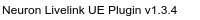
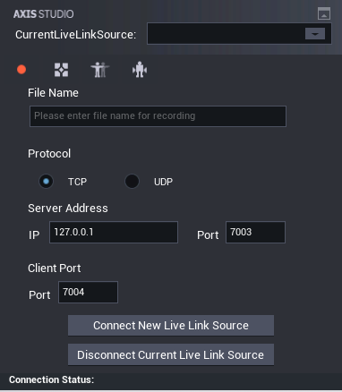

<!-- Suggest Edit With Typora -->

[TOC]

# Axis Unreal Live Link Plugin Handbook

# 1. Introduction

Axis Studio not only allows the export of motion capture data but also be able to stream motion capture data in real-time to third party applications, making the data available to drive characters in animation.

Axis studio act as a server on a network and stream motion capture data live to a client PC running a client application. In this document specifically go through the process about streaming data to Unreal Engine from Axis Studio with the NeuronLiveLink Plugin.



## 1.1 Features

* Support Unreal Engine version 4.26 4.27 5.0 5.1 5.2
* Support to receive and process the props (PWR-tracker) motion capture data (refer to our VPS project)
* Support to drive a skeleton that is not using T-pose based model, such as A-pose based model.
* Support to receive and process the displacement data from Axis Studio
* Send commands to control Axis Studio

## 1.2 Known Issues

* Error may occur when run executable after packaging.

## 1.3 About

1. Supported Development Platforms: Win64

# 2. Installation

1. Create a Plugins folder in your Unreal Engine Project if not exist

2. Extract **NeuronLiveLink**  plugin zip file to the Plugins folder you created.
   
   

# 3. Unreal Project Setup

1. Inside your Unreal project, from the Menu Bar under Edit, select Plugins.
   

2. Under the Animation section, click Enabled for Live Link.
    
   
     Under the Installed section, click Enabled for NeuronLiveLink then **restart** the Editor.
   
    

3. In the Content Browser Click View Option and enable Show Plugin Content.
   
    
    
   
   > This will enable the Live Link Plugin, which can be used to connect to external Digital Content Creation (DCC) tools. In order for your DCC tool to connect to Unreal, you will need to enable the corresponding plugin. In this section, we are establishing a connection with Axis Studio.

# 4. Quick Start

## 4.1 Open Axis Studio and Replay A file

> The operation step is base on Axis Studio2.4.11579.1201,.for operation on other version it is probably the same,Please check the manual of Axis Studio for further  information.
> 
> 
> You can also send realtime captured data through Axis Studio in this case,  you should edit setting in BVH capture.

* Follow the steps in the following picture to open "Axis Studio"
  
    

* Open a file to replay
    
    

* Open Settings Menu and modify
    
    

* Start to Replay
    

## 4.2 For Axis Hybrid Manager User, Setup Data Output

Foe Axis Hybrid Manager Users, Please follow the steps to setup mocap data output, or you can refer to Axis Hybrid Manager user manual data output management section.

* open Setting Window
  

* Setup Mocap data output
  

## 4.3 Open Unreal Project and Play an animation

* Open your Unreal Project with Neuron Live Link Plugin

* Open Live Link Window
    

* In Live Link Window, follow the steps to add Axis Neuron Live Source
    

* If the source is ready you will see Live link Subject(s) on the window, in the picture it is **chr00** you will use the name in the following steps.
    

* Go to Content browser, Open DemoMap(World'/NeuronLiveLink/Content/Demo/DemoMap.uMap') in Neuron Live Link Plugin
  
    

* In World Outliner Click "PNS_Actor" and edit Subject name
    

* Make sure your editor viewport is realtime
    

* You will sea a robot character move in the viewport
    

# 5. Import a new Skeletal Mesh

You can Import skeletal meshes from FBX file into Unreal engine. In this tutorial, A FBX file named **PN_Avatar.fbx** will be imported to Unreal Engine, you can find the file in the [*PluginBaseFolder*/Arts/PN_Avatar.fbx](../Arts/PN_Avatar.fbx)

* In Content browser, Click Import Button
    

* Locate to the FBX file you want to import, and Click Open
    

* In the **FBX Import Options** dialog box, choose the appropriate settings, making sure that the **Skeletal Mesh** option is enabled.
    
  
  > Note: If no existing Skeleton is selected, a new one will be created from the Skeletal Mesh being imported. The new Skeleton's name will be that of the Skeletal Mesh with *Skeleton* appended.

* Click **Import All** or **Import** button on the  above picture to  import the FBX file to Unreal Engine, the following Picture shows the assets import from the FBX file. Click **Save All** button on Content browser to save the assets.
     

# 6. Manipulate Animation Blueprint Asset to drive the skeleton

* Right-click on the Skeletal Mesh you want the Animation Blueprint to target and click Create > Amin Assets > Amin Blueprint.
    
    

* The Animation Blueprint is created in the same folder as the target Skeletal Mesh asset, with the name ready to be edited. you can edit its name or use the default name, in this tutorial we name it **BPA_PN_Avatar**
    

* Double click the Animation Blueprint **BPA_PN_Avatar** to edit the anim blueprint
  
    

* Pick live link subject name and connect to output pose
    

* Using NeuronBlend Node to handle some parts of body use displacement data and others not use
  The node is look like
    
  the following is detail panel of the node
    
  
  ```txt
  InputPose and RetargetAsset is the same as LiveLinkPose node
  BlendPoseBoneName is bone to split the with displacement date and without displacement data, use the bone next to Hips and in the chain from Hips to Head
  BlendWeights is the weight of layer without displacement data
  ```
  
  > This node is  provided after version 1.2.06, displacement data should be send in AxisStudio

* Go to Content browser, Add NeuronLiveLinkRemapAsset for the skeleton
    

* In the Pick Parent class Dialog, Pick "NeuronLiveLinkRemapAsset" as parent class
    

* The blueprint will be created in the Content browser, you can rename the asset as **PN_Avatar_RemapAsset** or another name
    

* Go back to the animation blueprint editor,  modify Retarget Asset for Live Link Pose
    

* Save the animation blueprint.  Next we will edit **PN_Avatar_RemapAsset** to remapping bone names

# 7. Remapping Bone Name

Your Skeletal Mesh may use different skeleton with Axis standard skeleton. In this situation you cannot apply NeuronLiveLinkRemapAsset to LiveLinkPose for your animation need to create your own retarget asset for your specific skeletal mesh. In this section we go through the setup process to create custom retarget asset.  on Part [Manipulate Animation Blueprint Asset to driven the skeleton](#6. Manipulate Animation Blueprint Asset to driven the skeleton) we have already create the remapping BP **PN_Avatar_RemapAsset** now we will start to edit the asset.

Our source bone names 

```c
Hips = 0,
RightUpLeg,
RightLeg,
RightFoot,
LeftUpLeg,
LeftLeg,
LeftFoot,
Spine,
Spine1,
Spine2,
Neck,
Neck1,
Head,
RightShoulder,
RightArm,
RightForeArm,
RightHand,
RightHandThumb1,
RightHandThumb2,
RightHandThumb3,
RightInHandIndex,
RightHandIndex1,
RightHandIndex2,
RightHandIndex3,
RightInHandMiddle,
RightHandMiddle1,
RightHandMiddle2,
RightHandMiddle3,
RightInHandRing,
RightHandRing1,
RightHandRing2,
RightHandRing3,
RightInHandPinky,
RightHandPinky1,
RightHandPinky2,
RightHandPinky3,
LeftShoulder,
LeftArm,
LeftForeArm,
LeftHand,
LeftHandThumb1,
LeftHandThumb2,
LeftHandThumb3,
LeftInHandIndex,
LeftHandIndex1,
LeftHandIndex2,
LeftHandIndex3,
LeftInHandMiddle,
LeftHandMiddle1,
LeftHandMiddle2,
LeftHandMiddle3,
LeftInHandRing,
LeftHandRing1,
LeftHandRing2,
LeftHandRing3,
LeftInHandPinky,
LeftHandPinky1,
LeftHandPinky2,
LeftHandPinky3,
Spine3,
```

> For Axis Neuron we use Hips~Spine2,Spine3,Neck,Head~LeftHandPinky3 as bone names, Neck1 not included
> 
> For  Axis Studio we use Hips~LeftHandPinky3  as bone names,  Spine3 not included

## 7.1 Remapping bone name by editor

* Double click **PN_Avatar_RemapAsset** in Content Browser to open Blueprint Editor, and make sure **Enable BoneMapping** is checked, and follow step 2-3 in the following picture to edit each bone mapping. 
    

* Import a skeleton for remapping selection
    
    

* Edit bone name prefix
    

* Edit UseDisplacementData
    

* If the Skeleton default pose is not T-Pose,  You can provide a T-Pose Animation Sequence to Live Link Pose Input Pose
    
  
  > There is a Simple way to add a T-pose animation for the skeleton, open the Skeleton you use, end drag the bone to T-pose, then you can save current pose to an animation sequence
  > 

## 7.2 Remapping bone names by override function

We recommand you to use the above method to modify remapping bones,  but if you want do more tricky thing with remapping you can override function GetRemappedBoneName defined  in NeuronLiveLinkRemapAsset to mapping the bone, make sure you uncheck "Enable BoneMapping "first


Here is an example for mapping finger bone with "InHand"  in bone names


## 7.3 Inherit From LiveLinkRetargetAsset to do your thing with retargeting

If you are an advance player, you want to do more about retargeting, you can inherit LiveLinkRetargetAsset in c++  and control the whole retargeting process like NeuronLiveLinkRemapAsset.

# 8. Using LiveLink Controller Component to control props

This is basic use of Live Link，You can refer to Unreal documents Using Live Link Data part from https://docs.unrealengine.com/4.27/en-US/AnimatingObjects/SkeletalMeshAnimation/LiveLinkPlugin/LiveLinkBlueprintComponent/. If the plugin receives Transform role data, you can use it to dirve your props.

# 9. Send commands to control Axis Studio

After version 1.2.06, you can send some control commands to AxisStudio in both editor and the package builds.

## 9.1 Supported Commands

* Start/Stop Recording

* Back to origin

* Calibratiuon for all

* Resume original posture
  
  > Do not suggest switch to another neuron livel link source and send commands to that source for the plugin do not know whether Axis studio is start recording data.
  > 
  > When use UDP Please do not use 255.255.255.255 as destination IP in Software(Axis Studio)
  > 
  > Scine version v1.2.20 user can add a 'TakeName' paremeter when sending Start Recording command, Axis Stusio will use a take name according the parameter.

## 9.2 How to use in editor

* Open Neuron Command Send window by Pressing "Neuron" button in the tool bar of Level Editor(like 1 in the following picture) or by pressing Neuron item in Window menu(like 2 in the following picture)
  
  
  the windiow is like
  
  

* In Live Link Window, Add Axis Neuron Live Source

* It could automatically select one axisneuron live link source when connected and you should select the correct one you want to send commands if there is more than one source.

* When "Connection Status" is "Online" in Neuron Command Send window, you can send commands to Axis Studio by pressing buttons in the window

## 9.3 How to use at runtime

You can add the actor blueprint WBP_AxisStudioUIController to your map to summon Neuron Command Send window when playing in editor or in a packaged version


The plugin use widget blueprint WBP_AxisStudio to send commands both in editor and at runtime.


You can see Connect and Disconnect button in runtime for add/remove Axis Neuron Live source



You can alse create you owning widget to send commands to Axis Studio. you can refer to WBP_AxisStudio for how to send commands.

> When Neuron Command Send window is opened in Editor, It will prompt you and close the window automatically if you open a new map or play in editor

## 9.4 Send commands to multi AxisStudio servers

Do not support sent command to multi servers in edit mode. But you can add more than one WBP_AxisStudioUIController actor to the map ands use it in PIE mode or your packaged application. Remember to set a different WidgetScreenPosition property in the actor detail panel for you WBP_AxisStudioUIController to make sure they do not show in the same position.


# 10. Projects Packaging

## 10.1 Implement animation driven In level blueprint

* On the **Main Toolbar** click the **Blueprints** button then select **Open Level Blueprint**
    
    Note: Event Graph displays and with default nodes **Event BeginPlay** and Event Tick.
    

* Add A variable for handle live link
  
  * Move Mouse over **+** button, click **+Variable** button to add **Variable** in My Blueprint panel and type a new name for the Variable in the Details panel and press Enter.
    
    
  * Set Variable Type as Structure (Live Link Source Handle) in the Details Panel.
      

* Create Neuron Live Link Source at runtime and connect it to **Event BeginPlay** in Event Graph.
  
  * Add **Create Neuron Live Link Source at runtime** Node and link to BeginPlay 
      
      
  
  * Create Set node and connect to **Create Neuron Live Link Source at runtime**.
      
      
  
  * Fill Connection String  Pin in **Create Neuron Live Link Source at runtime**
      Go back to Live Link Window
      
      Select Axis Studio source and Click **Show Advanced** in Settings panel
      
      Connect string and Factory will display in the Settings panel. 
    
      
      Copy Connection String in settings panel and paste it into **Create Neuron Live Link Source at runtime** node in Event Graph.
      

* Remove live link source and connect to **Event EndPlay** node
  
  * Right-Click to create **Event EndPlay**.
      
  * Create remove Source Node and link
      
  * Create **Get** node and connect to **Remove Source** node
      

* The event graph will show like the following image, Click Compile and Save the level blueprint
  
    

## 10.2 Put an Skeletal Mesh in your map and setup animation blueprint

​    In the **Content Browser**, locate the Skeletal Mesh you want to add to the map as a Skeletal Mesh Actor. Place it into the map and set its animation class like the following graph, then you can click play button and test your animation. If everything is ok, don't forget to **save** your map and other assets.


> NOTE: You can also drag your AnimationBlueprint into the viewport directely or use our **PNS_Actor** blueprint class but use you own skeletal mesh and animation blueprint to set you animation character.

## 10.3 Setup Game Default map

Before packaging your game, you will first need to set a **Game Default Map**, which will load when your packaged game starts. If you do not set a map and are using a blank project, you will only see a black screen when the packaged game starts. If you have used one of the template maps, like the First-Person template or Third Person template, the starting map will be loaded.

* Click on **Edit > Project Settings > Maps & Modes** in the Editor's main menu.
    
  
    
  
  > Note:  you may also need to specify your own game mode to use your own player character and player controller.

## 10.4 Package your Project to a executable binary

Click on File > Package Project > [PlatformName] in the Editor's main menu. (in the graph we select Windows 64-bit platform)


You will be presented with a dialog for selecting the target directory. If packaging completes successfully, this directory will then contain the packaged project.

# 11. Plugin Structure

```txt
|   NeuronLiveLink.uplugin    Plugin description file
|   BuildInfo    Basic Build info for plugin 
+---Arts
|       Mannequin_Tpose.FBX Unreal engine default Mannequin Tpose animation FBX
|       SK_Mannequin.FBX    Unreal engine default Mannequin skeletal mesh
|       Mixamo_Ch46_nonPBR.fbx Mixamo Ch46 model in FBX format
|       PN_Avatar.fbx    FBX File for import skeletal animation to unreal engine
|       PN_Avatar_Stickman01.fbx  Plugin default skeletal mesh
|       
+---Binaries
|   \---Win64    Binaries files of the plugin
|           
+---Content
|   |   BP_PNSBaseActor.uasset    Base actor for driving skeletal mesh animation in Axis Studio
|   |   PNS_Prop.uasset    Actor for driving props in Axis Studio
|   |
|   +---Maps
|   |       DemoMap.umap    Demo map for use the plugin
|   |       DemoMap_BuiltData.uasset    Build data for DemoMap
|   |       CommandTestMap.umap    Axis Studio Command test map
|   |       CommandTestMap_BuiltData.uasset    Build data for CommandTestMap
|   |
|   +---Mannequin    Mannequin skeletal mesh, materials, textures, animation blueprint, remap asset and actor object in UE4
|   |
|   +---Mixamo_Ch46  Mixamo ch46 skeletal mesh, materials, textures, animation blueprint, remap asset and actor object
|   |
|   \---PNSChar  default skeletal mesh, materials, textures, animation blueprint, remap asset and actor object
|           
+---Doc
|       AxisUnrealLiveLinkPlugin Handbook_EN.pdf    This handbook in English language version
|       AxisUnrealLiveLinkPlugin Handbook_CN.pdf    This handbook in Chinese language version
|       
+---Intermediate    Intermediate fies(generated header files, precompiled object files etc.) for the plugin
|                           
+---Resources
|       Icon128.png    Icon files for plugin
|       ButtonIcon_40x.png    Neuron button icon
|       
\---Source    Sources files for Plugin
    +---NeuronLiveLink    Live link runtime module for neuron(mocapApi)
    |   |   NeuronLiveLink.Build.cs    Module build file
    |   |       
    |   +---Private
    |   |       AnimNode_NeuronBlend.cpp
    |   |       MocapApiLog.cpp
    |   |       MocapAppManager.cpp
    |   |       MocapClient.cpp
    |   |       MocapStructs.cpp
    |   |       NeuronLiveLink.cpp
    |   |       NeuronLiveLinkBPLibrary.cpp
    |   |       NeuronLiveLinkLog.cpp
    |   |       NeuronLiveLinkRemapAsset.cpp
    |   |       NeuronLiveLinkSource.cpp
    |   |       NeuronLiveLinkSourceFactory.cpp
    |   |       NeuronVPVolume.cpp
    |   |       PNSAnimInstance.cpp
    |   |       SNeuronLiveLinkSourceFactory.cpp
    |   |       SubjectNameSetter.cpp
    |   |
    |   \---Public
    |           AnimNode_NeuronBlend.h    NeuronBlend animation node
    |           MocapApiLog.h    Log category used in this module
    |           MocapAppManager.h    Mocap application manager
    |           MocapClient.h    MocapClient for receiving axis studio data in live link
    |           MocapStructs.h    Struct used in unreal engine for MocapApi
    |           NeuronBoneMappingInfo.h    Bone mapping info for retargeting
    |           NeuronLiveLink.h    Module interface file
    |           NeuronLiveLinkBPLibrary.h    Blueprint library
    |           NeuronLiveLinkLog.h    Log category used in this module
    |           NeuronLiveLinkRemapAsset.h    Retargrting asset for dirving animation data
    |           NeuronLiveLinkSource.h    Live link source for neuron
    |           NeuronLiveLinkSourceFactory.h    Factory for create NeuronLiveLinkSource
    |           PNSAnimInstance.h    Blueprint amimation instance(can set subject name) for diving animation data
    |           SNeuronLiveLinkSourceFactory.h    Editor UI for create NeuronLiveLinkSource
    |           SubjectNameSetter.h    Subject name setter for animation blueprint
    |
    \---ThirdParty
        +---MocapApi    exteral MocapApi C++ lib to receive data form axis studio
        |   +---bin    MocapApi C++ lib binary files
        |   +---doc    MocapApi dociument
        |   \---include
        |           MocapApi.h    MocapApi C++ lib header file
        |
        +---NeuronGraphNode
        |       AnimGraphNode_NeuronBlend.cpp
        |       AnimGraphNode_NeuronBlend.h    NeuronBlend animation graph node
        |       NeuronGraphNode.Build.cs    Module build file
        |       NeuronGraphNodeModule.cpp
        |
        \---NeuronLiveLinkEditor    Neuron Live Link Editor module
            |   NeuronLiveLinkEditor.Build.cs    Module build file
            |
            +---Private
            |       NeuronBoneMappingWidget.cpp
            |       NeuronEditorWindowCommands.cpp
            |       NeuronEditorWindowStyle.cpp
            |       NeuronLiveLinkEditorModule.cpp
            |       NeuronLiveLinkRemapAssetDetailCustomization.cpp
            |
            \---Public
                    LiveLinkEditorPrivate.h    Module interface file
                    NeuronBoneMappingWidget.h    Bone mapping editor UI
                    NeuronEditorWindowCommands.h   eidtor command
                    NeuronEditorWindowStyle.h    editor style
                    NeuronLiveLinkRemapAssetDetailCustomization.h    Remap editor for Neuron
```

# 12 FAQ

* Got compile error when rebuild my project.
    Our plugin use precompiled files and there is a rebuild bug in unreal engine which will delete the precompiled files if you rebuild your project. so please download the plugin again and replace the files in Intermediate folder with the new downloaded files and click build to build again. 
* Got error when packaging the project in some version of unreal(e.g. UE5)
  Please convert it to a c++ project and try again, some unreal engine versions have such issue.
